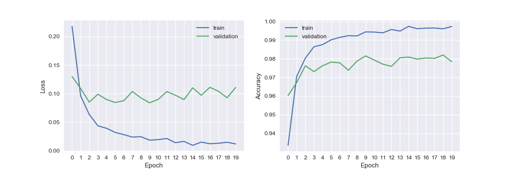
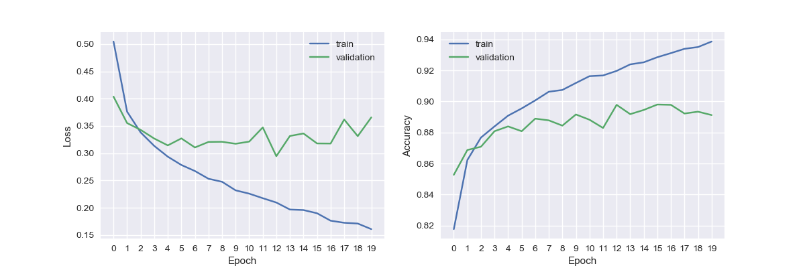
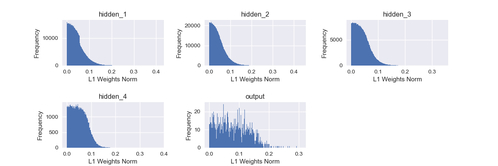
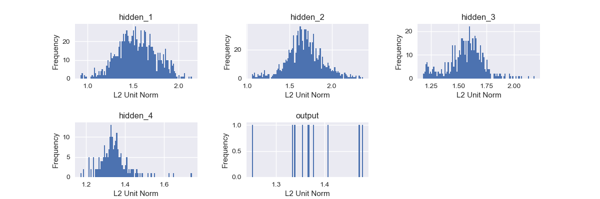
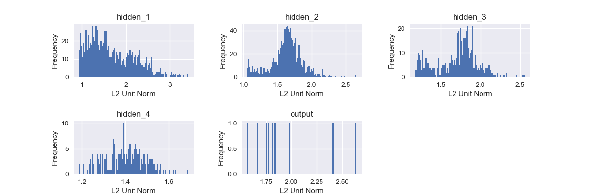
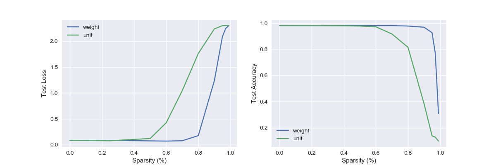
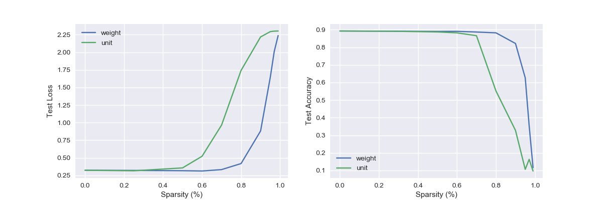

# network-pruning
Train a very large neural network, then make it very small.

## Table of Contents
- [network-pruning](#network-pruning)
  - [Table of Contents](#table-of-contents)
  - [Requirements](#requirements)
  - [Quick Start](#quick-start)
    - [Directory Structure](#directory-structure)
    - [Datasets](#datasets)
    - [Flags](#flags)
  - [Experiments](#experiments)
  - [Results](#results)
    - [Training](#training)
    - [Pruning](#pruning)
    - [Sparsity](#sparsity)
  - [Discussion](#discussion)
  - [References](#references)

## Requirements

## Quick Start

Training and pruning are controlled by a single command:

```[bash]
$ python -m network-pruning.train
```

A unique `experiment_id` is either specified by the user or generated using a subset of flag parameters (`dataset`, `epoch`, and `learning_rate`). Checkpoints and results will be written to `./<output_dir>/<experiment_id>`. If this results directory already exists, the script will run pruning experiments without retraining. To retrain the model, either specify the `--force_train` flag or delete the results directory and rerun the command.

### Directory Structure

The code is organized as follows:

```[txt]
├── README.md
├── __init__.py
├── data                              # Data loading and preprocessing
│   ├── __init__.py
│   ├── data_loaders
│   │   ├── __init__.py
│   │   ├── loader_utils.py
│   │   ├── mnist_digits_loader.py
│   │   └── mnist_fashion_loader.py
│   └── registry.py
├── models                            # Model construction and pruning
│   ├── __init__.py
│   └── model.py
├── references                        # Figures used in README.md
├── results                           # Default directory for checkpoints,
│   ├── <experiment_id>               #   figures, metrics, etc.
│   │   ├── checkpoints
│   │   │   └── weights.best.hdf5
│   │   ├── *.png
│   │   └── results.csv
│   └── ...
├── train.py                          # Training and pruning
├── utils.py                          # General helper methods
└── visualization                     # Plotting and result formatting
    ├── csv.py
    ├── gifs.py
    └── graph.py
```

### Datasets

Experiments can be run on either the [MNIST Digits](http://yann.lecun.com/exdb/mnist/) or [MNIST Fashion](https://github.com/zalandoresearch/fashion-mnist) datasets using the `--dataset={digits|fashion}` flag.

### Flags

Flags are provided to easily control experiments. For example,

```[bash]
$ python -m network-pruning.train --dataset=digits --epochs=20 --learning_rate=0.001
```

A full list of flags can be found here:
```[bash]
$ python -m network-pruning.train --help

Trains the model and runs pruning experiments.

flags:

/Users/tino/code/git/research/network-pruning/train.py:
  --batch_size: The batch size
    (default: '128')
    (an integer)
  --dataset: The dataset. Valid options are: {'digits' | 'fashion'}.
    (default: 'digits')
  --epochs: Number of training epochs to perform.
    (default: '20')
    (an integer)
  --experiment_id: A unique name to identify the current model and experiment.
  --[no]force_train: If true, overwrite existing model for given hparam config.
    (default: 'false')
  --k_vals: A list of sparsity values to use in pruning experiments.
    (default: '0.0,0.25,0.5,0.6,0.7,0.8,0.9,0.95,0.97,0.99')
    (a comma separated list)
  --[no]keep_best: If true, keep the best validation acc model when checkpointing.
    (default: 'true')
  --learning_rate: The optimizer's learning rate.
    (default: '0.001')
    (a number)
  --num_valid: The size of the validation dataset
    (default: '10000')
    (an integer)
  --output_dir: The output directory for checkpoints, figures, etc.
    (default: '/path/to/network-pruning/results/')

Try --helpfull to get a list of all flags.
```

## Experiments

## Results

All presented results were generated using the following two runs:

```[bash]
$ python -m network-pruning.train --dataset=digits --epochs=20 --learning_rate=0.001 --force_train
[...]
$ python -m network-pruning.train --dataset=fashion --epochs=20 --learning_rate=0.001 --force_train
[...]
```

### Training


*MNIST Digit training loss and accuracy over 20 epochs*


*MNIST Fashion training loss and accuracy over 20 epochs*

### Pruning


*L1 norm distribution of MNIST Digit model weights during sparsification over k%=[0, 25, 50, 60, 70, 80, 90, 95, 97, 99]. Note: 0 weights are not shown because the distribution of 0-weighted elements quickly overshadowed all other values.*


*L1 norm distribution of MNIST Fashion model weights during sparsification over k%=[0, 25, 50, 60, 70, 80, 90, 95, 97, 99]. Note: 0 weights are not shown because the distribution of 0-weighted elements quickly overshadowed all other values.*


*2 norm distribution of MNIST Digit model unit columns during sparsification over k%=[0, 25, 50, 60, 70, 80, 90, 95, 97, 99].*


*L2 norm distribution of MNIST Fashion model unit columns during sparsification over k%=[0, 25, 50, 60, 70, 80, 90, 95, 97, 99].*


*MNIST Digit test loss and accuracy during sparsification over k%=[0, 25, 50, 60, 70, 80, 90, 95, 97, 99].*


*MNIST Fashion test loss and accuracy during sparsification over k%=[0, 25, 50, 60, 70, 80, 90, 95, 97, 99].*

Digits:

Sparsity (%)  |  Test Accuracy (Unit)  |  Test Accuracy (Weight)  |  Test Loss: (Weight)  |  Test Loss: (Unit)
--------------|--------------------------------|----------------------------------|-------------------------------|---------------------------
0.0000        |  0.9813                        |  0.9813                          |  0.0857                       |  0.0857
0.2500        |  0.9806                        |  0.9812                          |  0.0851                       |  0.0771
0.5000        |  0.9813                        |  0.9778                          |  0.0751                       |  0.1213
0.6000        |  0.9805                        |  0.9719                          |  0.0712                       |  0.4253
0.7000        |  0.9811                        |  0.9170                          |  0.0777                       |  1.0453
0.8000        |  0.9777                        |  0.8156                          |  0.1764                       |  1.7635
0.9000        |  0.9688                        |  0.3849                          |  1.2375                       |  2.2381
0.9500        |  0.9269                        |  0.1383                          |  2.0858                       |  2.3008
0.9700        |  0.7721                        |  0.1280                          |  2.2456                       |  2.3023
0.9900        |  0.3091                        |  0.0980                          |  2.2996           |   2.3026

Fashion:

Sparsity (%)  |  Test Accuracy (Unit)  |  Test Accuracy (Weight)  |  Test Loss: (Weight)  |  Test Loss: (Unit)
--------------|--------------------------------|----------------------------------|-------------------------------|---------------------------
0.0000        |  0.8924                        |  0.8924                          |  0.3234                       |  0.3234
0.2500        |  0.8912                        |  0.8915                          |  0.3214                       |  0.3158
0.5000        |  0.8900                        |  0.8869                          |  0.3171                       |  0.3568
0.6000        |  0.8905                        |  0.8819                          |  0.3128                       |  0.5224
0.7000        |  0.8866                        |  0.8657                          |  0.3329                       |  0.9656
0.8000        |  0.8819                        |  0.5516                          |  0.4186                       |  1.7427
0.9000        |  0.8215                        |  0.3278                          |  0.8818                       |  2.2183
0.9500        |  0.6263                        |  0.1065                          |  1.6489                       |  2.2940
0.9700        |  0.3554                        |  0.1634                          |  2.0118                       |  2.3008
0.9900        |  0.1161                        |  0.0971                          |  2.2380                       |  2.3027

### Sparsity

## Discussion

## References
