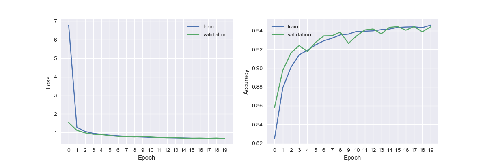
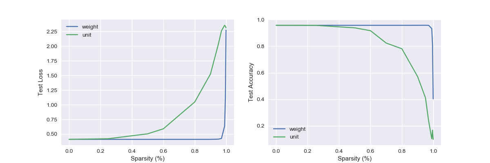
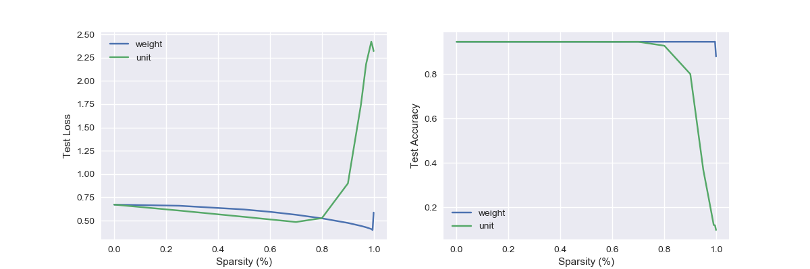
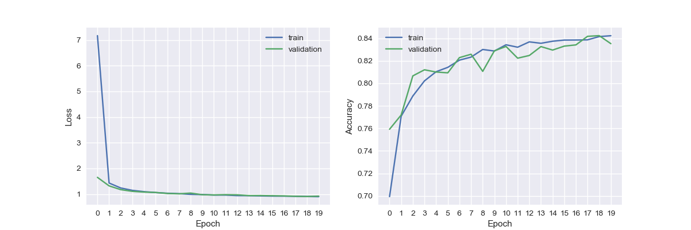
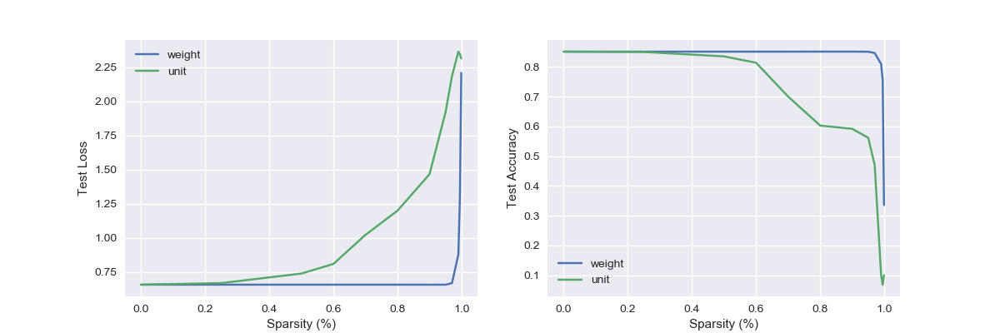
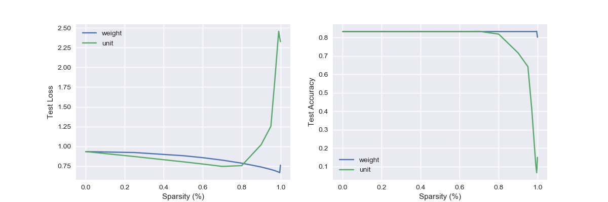

# network-pruning
Train a very large neural network, then make it very small.

## Table of Contents
- [network-pruning](#network-pruning)
  - [Table of Contents](#table-of-contents)
  - [Requirements](#requirements)
  - [Quick Start](#quick-start)
    - [Directory Structure](#directory-structure)
    - [Datasets](#datasets)
    - [Flags](#flags)
  - [Experiments](#experiments)
  - [Results](#results)
    - [Training](#training)
    - [Pruning](#pruning)
  - [Analysis](#analysis)
    - [Original Experiments](#original-experiments)
    - [Regularization](#regularization)

## Requirements

All requirements are listed in `requirements.txt`. To install, run

```[bash]
pip install -r requirements.txt
```

## Quick Start

Training and pruning are controlled by a single command. To use the experiment module, navigate to the module's parent directory and run

```[bash]
$ python -m network-pruning.train
```

A unique `experiment_id` is either specified by the user or generated using a subset of flag parameters (`dataset`, `epoch`, `learning_rate`, and regularization lambdas). Checkpoints and results will be written to `./<output_dir>/<experiment_id>`. If this results directory already exists, the script will run pruning experiments without retraining. To retrain the model, either specify the `--force_train` flag or delete the results directory and rerun the command.

### Directory Structure

The code is organized as follows:

```[txt]
├── README.md
├── __init__.py
├── data                              # Data loading and preprocessing
│   ├── __init__.py
│   ├── data_loaders
│   │   ├── __init__.py
│   │   ├── loader_utils.py
│   │   ├── mnist_digits_loader.py
│   │   └── mnist_fashion_loader.py
│   └── registry.py
├── models                            # Model construction and pruning
│   ├── __init__.py
│   └── model.py
├── references                        # Figures and csv used in README.md
├── results                           # Default directory for checkpoints,
│   ├── <experiment_id>               #   figures, metrics, etc.
│   │   ├── checkpoints
│   │   │   └── weights.best.hdf5
│   │   ├── *.png
│   │   └── results.csv
│   └── ...
├── train.py                          # Training and pruning
├── utils.py                          # General helper methods
└── visualization                     # Plotting and result formatting
    ├── csv.py
    ├── gifs.py
    └── graph.py
```

### Datasets

Experiments can be run on either the [MNIST Digits](http://yann.lecun.com/exdb/mnist/) or [MNIST Fashion](https://github.com/zalandoresearch/fashion-mnist) datasets using the `--dataset={digits|fashion}` flag.

### Flags

Flags are provided to easily control experiments. For example,

```[bash]
$ python -m network-pruning.train --dataset=digits --epochs=20 --learning_rate=0.001
```

A full list of flags can be found here:
```[bash]
$ python -m network-pruning.train --help

Trains the model and runs pruning experiments.

flags:
/path/to/network-pruning/train.py:
  --batch_size: The batch size
    (default: '128')
    (an integer)
  --dataset: The dataset. Valid options are: {'digits' | 'fashion'}.
    (default: 'digits')
  --epochs: Number of training epochs to perform.
    (default: '20')
    (an integer)
  --experiment_id: A unique name to identify the current model and experiment.
  --[no]force_train: If true, overwrite existing model for given hparam config.
    (default: 'false')
  --k_vals: A list of sparsity values to use in pruning experiments.
    (default: '0.0,0.25,0.5,0.6,0.7,0.8,0.9,0.95,0.97,0.99')
    (a comma separated list)
  --[no]keep_best: If true, keep the best validation acc model when checkpointing.
    (default: 'true')
  --l1_reg: l1 regularization lambda
    (default: '0.0')
    (a number)
  --l2_reg: l2 regularization lambda
    (default: '0.0')
    (a number)
  --learning_rate: The optimizer's learning rate.
    (default: '0.001')
    (a number)
  --num_valid: The size of the validation dataset
    (default: '10000')
    (an integer)
  --output_dir: The output directory for checkpoints, figures, etc.
    (default: '/path/to/network-pruning/results/')

Try --helpfull to get a list of all flags.
```

## Experiments

Experiments were run on a dense network with four hidden layers:

```[text]
Layer (type)                 Output Shape              Param #
=================================================================
hidden_1 (Dense)             (None, 1000)              784000
_________________________________________________________________
hidden_2 (Dense)             (None, 1000)              1000000
_________________________________________________________________
hidden_3 (Dense)             (None, 500)               500000
_________________________________________________________________
hidden_4 (Dense)             (None, 200)               100000
_________________________________________________________________
output (Dense)               (None, 10)                2000
=================================================================
Total params: 2,386,000
Trainable params: 2,386,000
Non-trainable params: 0
_________________________________________________________________
```

Each hidden layer used a ReLU activation function while the final output layer used a softmax activation function. Relevant training configuration information includes:

- epochs: 20
- batch size: 128
- validation set size: 10,000
- Adam optimizer with a learning rate of 0.001 and default beta/epsilon/decay values
- data was shuffled before each epoch

Snapshots were taken after each epoch if the model improved on the existing snapshot's validation loss.

For each value `k = [0, 25, 50, 60, 70, 80, 90, 95, 97, 99, 99.5, 99.9]`, the pre-trained model was cloned twice. Each clone was pruned to k% sparsity using either weight pruning or unit pruning. The pruned model was then assessed using the standard test dataset. The distribution of L1 model weights or L2 unit norms were measured at each sparsity interval.

All experiments were run on both the MNIST Digits and MNIST Fashion datasets.

## Results

All presented results were generated using the following two configurations:

```[bash]
$ python -m network-pruning.train --dataset=digits --epochs=20 --learning_rate=0.001 --force_train
[...]
$ python -m network-pruning.train --dataset=fashion --epochs=20 --learning_rate=0.001 --force_train
[...]
```

Note: Figures and tables presented in this section are available in the `./references` directory. Though I typically don't like committing binary files and individual results to git, it's done for ease of access here. I pruned (yikes) the references directory of unnecessary pngs to decrease file size.

### Training

The following two figures show the model's loss and accuracy during training.

> 
> *MNIST Digit training loss and accuracy over 20 epochs*

> 
> *MNIST Fashion training loss and accuracy over 20 epochs*

### Pruning

The following four figures depict the model's L1 weight norm distribution and L2 unit norm distribution throughout the sparsification process for the two datasets. As expected, low-valued weights and units are removed from the model as sparsification increases.

> 
> *L1 norm distribution of MNIST Digit model weights during sparsification over k%=[0, 25, 50, 60, 70, 80, 90, 95, 97, 99, 99.5, 99.9]. Note: 0 weights are not shown because the distribution of 0-weighted elements quickly overshadowed all other values.*

> 
> *L1 norm distribution of MNIST Fashion model weights during sparsification over k%=[0, 25, 50, 60, 70, 80, 90, 95, 97, 99, 99.5, 99.9]. Note: 0 weights are not shown because the distribution of 0-weighted elements quickly overshadowed all other values.*

> 
> *L2 norm distribution of MNIST Digit model unit columns during sparsification over k%=[0, 25, 50, 60, 70, 80, 90, 95, 97, 99, 99.5, 99.9].*

> 
> *L2 norm distribution of MNIST Fashion model unit columns during sparsification over k%=[0, 25, 50, 60, 70, 80, 90, 95, 97, 99, 99.5, 99.9].*

The following two figures compare test loss and test accuracy as sparsity changes. These values are also presented in the two tables below.

> 
> *MNIST Digit test loss and accuracy during sparsification over k%=[0, 25, 50, 60, 70, 80, 90, 95, 97, 99, 99.5, 99.9].*

> 
> *MNIST Fashion test loss and accuracy during sparsification over k%=[0, 25, 50, 60, 70, 80, 90, 95, 97, 99, 99.5, 99.9].*

MNIST Digits:

Sparsity (%)  |  Test Accuracy (Weight)  |  Test Accuracy (Unit)  |  Test Loss: (Weight)  |  Test Loss: (Unit)
--------------|--------------------------|------------------------|-----------------------|-------------------
0.0000        |  0.9770                  |  0.9770                |  0.0835               |  0.0835
0.2500        |  0.9766                  |  0.9729                |  0.0831               |  0.1077
0.5000        |  0.9761                  |  0.9331                |  0.0833               |  0.6293
0.6000        |  0.9763                  |  0.8959                |  0.0955               |  1.1780
0.7000        |  0.9732                  |  0.7968                |  0.1683               |  1.7400
0.8000        |  0.9722                  |  0.5242                |  0.4963               |  2.1341
0.9000        |  0.9553                  |  0.1733                |  1.6544               |  2.2891
0.9500        |  0.8081                  |  0.1303                |  2.1806               |  2.3011
0.9700        |  0.6536                  |  0.1387                |  2.2701               |  2.3023
0.9900        |  0.2989                  |  0.1128                |  2.3010               |  2.3026
0.9950        |  0.2192                  |  0.1085                |  2.3024               |  2.3026
0.9990        |  0.0564                  |  0.0980                |  2.3026               |  2.3026


MNIST Fashion:

Sparsity (%)  |  Test Accuracy (Weight)  |  Test Accuracy (Unit)  |  Test Loss: (Weight)  |  Test Loss: (Unit)
--------------|--------------------------|------------------------|-----------------------|-------------------
0.0000        |  0.8851                  |  0.8851                |  0.3301               |  0.3301
0.2500        |  0.8860                  |  0.8851                |  0.3282               |  0.3285
0.5000        |  0.8857                  |  0.8762                |  0.3288               |  0.4029
0.6000        |  0.8815                  |  0.8584                |  0.3457               |  0.6464
0.7000        |  0.8691                  |  0.8142                |  0.3940               |  1.1262
0.8000        |  0.8626                  |  0.5599                |  0.5275               |  1.7695
0.9000        |  0.8045                  |  0.3021                |  1.1085               |  2.2208
0.9500        |  0.5962                  |  0.2072                |  1.8238               |  2.2953
0.9700        |  0.4113                  |  0.1228                |  2.1279               |  2.3015
0.9900        |  0.1609                  |  0.0231                |  2.2944               |  2.3027
0.9950        |  0.0993                  |  0.0635                |  2.3092               |  2.3028
0.9990        |  0.0156                  |  0.1000                |  2.3042               |  2.3026

## Analysis

### Original Experiments

As expected, network performance degraded as sparsity increased with both weight and unit pruning. It's evident that we can prune a large portion of an unregularized network before accuracy decreases significantly: ~k=.9 for weight pruning and ~k=.7 for unit pruning. Though we are using a relatively simply heuristic for ranking the contribution of units within the network (weight and unit norms), we achieve reasonable results without relying on more complex ranking methodologies. Model complexity can be defined as a function of the model's weights and can be quantified by the L1 and L2 metrics. Given these metrics, the histograms plotting model complexity show that the model contains a number of low-contributing weights/units after training. Thus these low-valued weights can be pruned without drastically impacting model complexity. Many commercial use cases may prefer improving model size/speed over the slight increase in accuracy provided by a denser model.

There is a clear tradeoff between parameterization and accuracy. With too many parameters, the model overfits and fails to generalize to novel data points. With too few parameters, the model is unable to fully represent features within the dataset and cannot make useful predictions. We see that as sparsity increases, the model approaches, or at times is worse, than randomly guessing classes (10% accuracy).

It is unsurprising that weight pruning outperforms unit pruning as sparsity increases. When selecting the k% of units to prune, we examine the L2 norm of each column in the weight matrix. It is likely that each column is made up of weights of varying magnitudes. Thus, it is possible for a column that has a single, high contributing weight to be pruned in favor of a higher magnitude column containing a number of medium-sized weights. We can view weight pruning as distributing the same amount of sparsity across a larger number of units. Thus, individual units with a few high magnitude weights can continue to contribute to the overall classification task while zeroing-out their many unimportant, small weights.

The relative performance of each pruning method is similar regardless of dataset.

### Regularization

Original training and validation loss show a large generalization gap, suggesting that the model is overfitting the training data and failing to generalize to the validation set. In an effort to reduce validation error but not training error, one can apply L1 or L2 regularization to the network's hidden layers. The resulting learning curves show far less divergence than the unregularized model.

Both L1 and L2 regularization penalize the model for large weight matrices. L1 regularization penalizes the sum of the absolute values of the weights while L2 regularization penalizes the sum of the squares of all the feature weights. Thus L1 regularization will shrink unimportant weights to zero and L2 regularization encourages weight values towards zero but not exactly zero.

By driving weights to zero, L1 regularization creates a sparse model during the training process. Therefore, when pruning the model, a large percentage of weights are already zero and pruning them has no impact on the model's accuracy. This makes such models particularly resistant to our pruning process. As shown in the figures and tables below, the MNIST digits weighted test accuracy actually *increases* when pruning 99.5% of weights and only decreases 6.67% when pruning 99.9% of the weights (compared to the 92.06% decrease in the unregularized model).

L2 regularization also improves the model's robustness to pruning. However, because this regularization method only encourages weights to approach zero but doesn't force them to exactly zero, 99-99.9% sparsity results in a sharper decrease in accuracy when compared to L1 regularization.

Thus, when pruning a model, it makes sense to encourage sparse representations during the training process. This makes the models more robust to pruning at high sparsity percentiles.

> 
> *MNIST Digit training loss and accuracy over 20 epochs. The original network was trained with L1 regularization (lambda=0.001).*

> 
> *MNIST Digit test loss and accuracy during sparsification over k%=[0, 25, 50, 60, 70, 80, 90, 95, 97, 99, 99.5, 99.9]. The original network was trained with L2 regularization (lambda=0.01).*

> 
> *MNIST Digit test loss and accuracy during sparsification over k%=[0, 25, 50, 60, 70, 80, 90, 95, 97, 99, 99.5, 99.9]. The original network was trained with L1 regularization (lambda=0.001).*

MNIST Digit results with L1 regularization (lambda=0.001):

Sparsity (%)  |  Test Accuracy (Weight)  |  Test Accuracy (Unit)  |  Test Loss: (Weight)  |  Test Loss: (Unit)
--------------|--------------------------|------------------------|-----------------------|-------------------
0.0000        |  0.9459                  |  0.9459                |  0.6719               |  0.6719
0.2500        |  0.9459                  |  0.9458                |  0.6600               |  0.6082
0.5000        |  0.9459                  |  0.9458                |  0.6198               |  0.5409
0.6000        |  0.9459                  |  0.9456                |  0.5946               |  0.5128
0.7000        |  0.9459                  |  0.9459                |  0.5632               |  0.4853
0.8000        |  0.9459                  |  0.9282                |  0.5246               |  0.5274
0.9000        |  0.9460                  |  0.8007                |  0.4754               |  0.9001
0.9500        |  0.9459                  |  0.3688                |  0.4436               |  1.7425
0.9700        |  0.9459                  |  0.2461                |  0.4286               |  2.1810
0.9900        |  0.9458                  |  0.1207                |  0.4099               |  2.4213
0.9950        |  0.9464                  |  0.1190                |  0.3995               |  2.3698
0.9990        |  0.8797                  |  0.0980                |  0.5869               |  2.3205

The same pattern can be seen using the MNIST fashion dataset:

> 
> *MNIST Fashion training loss and accuracy over 20 epochs. The original network was trained with L1 regularization (lambda=0.001).*

> 
> *MNIST Fashion test loss and accuracy during sparsification over k%=[0, 25, 50, 60, 70, 80, 90, 95, 97, 99, 99.5, 99.9]. The original network was trained with L2 regularization (lambda=0.01).*

> 
> *MNIST Fashion test loss and accuracy during sparsification over k%=[0, 25, 50, 60, 70, 80, 90, 95, 97, 99, 99.5, 99.9]. The original network was trained with L1 regularization (lambda=0.001).*

MNIST Fashion results with L1 regularization (lambda=0.001):

Sparsity (%)  |  Test Accuracy (Weight)  |  Test Accuracy (Unit)  |  Test Loss: (Weight)  |  Test Loss: (Unit)
--------------|--------------------------|------------------------|-----------------------|-------------------
0.0000        |  0.8322                  |  0.8322                |  0.9329               |  0.9329
0.2500        |  0.8322                  |  0.8323                |  0.9210               |  0.8702
0.5000        |  0.8321                  |  0.8320                |  0.8810               |  0.8034
0.6000        |  0.8323                  |  0.8321                |  0.8560               |  0.7755
0.7000        |  0.8323                  |  0.8335                |  0.8248               |  0.7453
0.8000        |  0.8322                  |  0.8185                |  0.7864               |  0.7548
0.9000        |  0.8323                  |  0.7161                |  0.7377               |  1.0203
0.9500        |  0.8323                  |  0.6420                |  0.7063               |  1.2540
0.9700        |  0.8323                  |  0.4081                |  0.6916               |  1.8347
0.9900        |  0.8325                  |  0.1129                |  0.6735               |  2.4571
0.9950        |  0.8337                  |  0.0665                |  0.6653               |  2.3778
0.9990        |  0.8017                  |  0.1500                |  0.7609               |  2.3263
