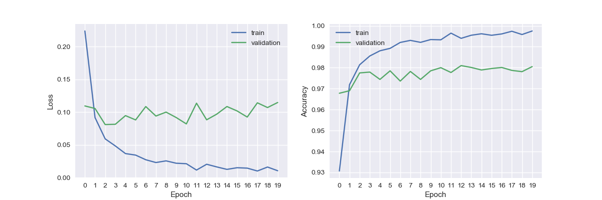
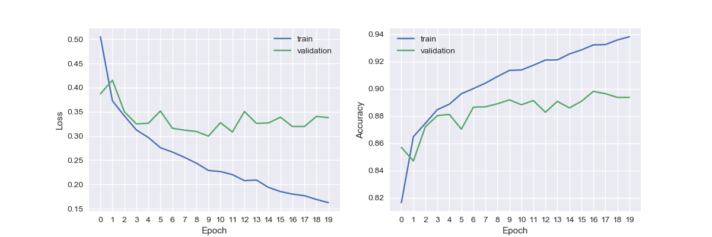
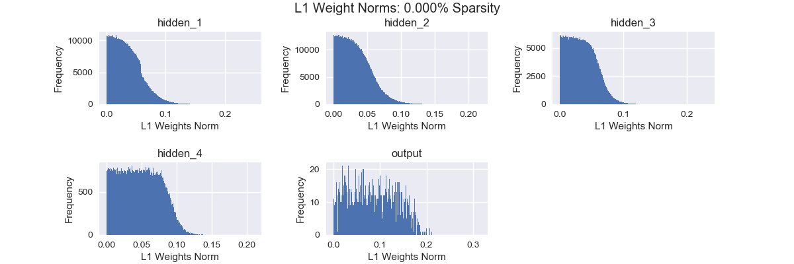
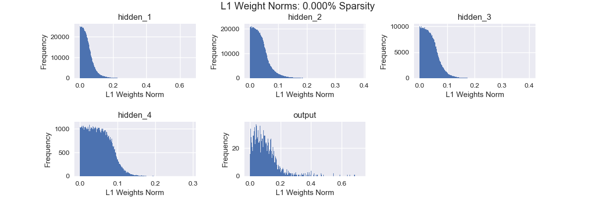
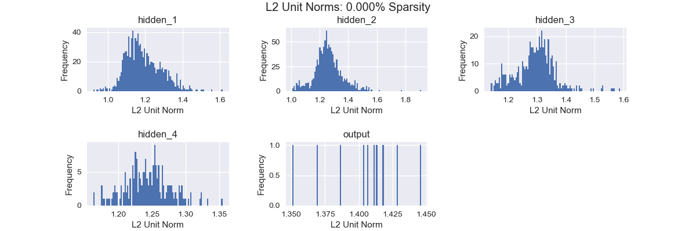
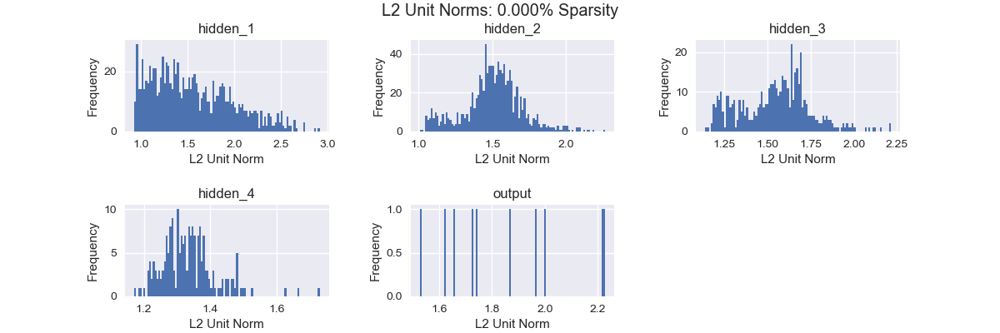
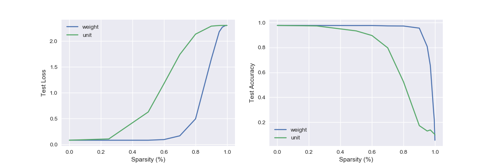
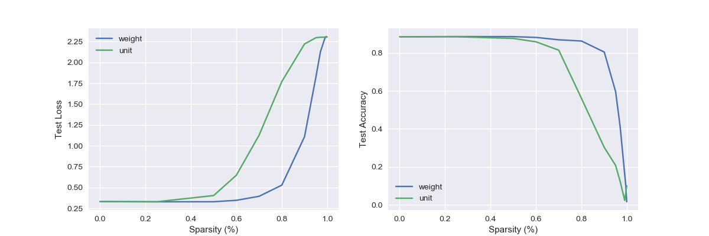

# network-pruning
Train a very large neural network, then make it very small.

## Table of Contents
- [network-pruning](#network-pruning)
  - [Table of Contents](#table-of-contents)
  - [Requirements](#requirements)
  - [Quick Start](#quick-start)
    - [Directory Structure](#directory-structure)
    - [Datasets](#datasets)
    - [Flags](#flags)
  - [Experiments](#experiments)
  - [Results](#results)
    - [Training](#training)
    - [Pruning](#pruning)

## Requirements

All requirements are listed in `requirements.txt`. To install, run

```[bash]
pip install -r requirements.txt
```

## Quick Start

Training and pruning are controlled by a single command. To use the experiment module, navigate to the module's parent directory and run

```[bash]
$ python -m network-pruning.train
```

A unique `experiment_id` is either specified by the user or generated using a subset of flag parameters (`dataset`, `epoch`, `learning_rate`, and regularization lambdas). Checkpoints and results will be written to `./<output_dir>/<experiment_id>`. If this results directory already exists, the script will run pruning experiments without retraining. To retrain the model, either specify the `--force_train` flag or delete the results directory and rerun the command.

### Directory Structure

The code is organized as follows:

```[txt]
├── README.md
├── __init__.py
├── data                              # Data loading and preprocessing
│   ├── __init__.py
│   ├── data_loaders
│   │   ├── __init__.py
│   │   ├── loader_utils.py
│   │   ├── mnist_digits_loader.py
│   │   └── mnist_fashion_loader.py
│   └── registry.py
├── models                            # Model construction and pruning
│   ├── __init__.py
│   └── model.py
├── references                        # Figures and csv used in README.md
├── results                           # Default directory for checkpoints,
│   ├── <experiment_id>               #   figures, metrics, etc.
│   │   ├── checkpoints
│   │   │   └── weights.best.hdf5
│   │   ├── *.png
│   │   └── results.csv
│   └── ...
├── train.py                          # Training and pruning
├── utils.py                          # General helper methods
└── visualization                     # Plotting and result formatting
    ├── csv.py
    ├── gifs.py
    └── graph.py
```

### Datasets

Experiments can be run on either the [MNIST Digits](http://yann.lecun.com/exdb/mnist/) or [MNIST Fashion](https://github.com/zalandoresearch/fashion-mnist) datasets using the `--dataset={digits|fashion}` flag.

### Flags

Flags are provided to easily control experiments. For example,

```[bash]
$ python -m network-pruning.train --dataset=digits --epochs=20 --learning_rate=0.001
```

A full list of flags can be found here:
```[bash]
$ python -m network-pruning.train --help

Trains the model and runs pruning experiments.

flags:
/path/to/network-pruning/train.py:
  --batch_size: The batch size
    (default: '128')
    (an integer)
  --dataset: The dataset. Valid options are: {'digits' | 'fashion'}.
    (default: 'digits')
  --epochs: Number of training epochs to perform.
    (default: '20')
    (an integer)
  --experiment_id: A unique name to identify the current model and experiment.
  --[no]force_train: If true, overwrite existing model for given hparam config.
    (default: 'false')
  --k_vals: A list of sparsity values to use in pruning experiments.
    (default: '0.0,0.25,0.5,0.6,0.7,0.8,0.9,0.95,0.97,0.99')
    (a comma separated list)
  --[no]keep_best: If true, keep the best validation acc model when checkpointing.
    (default: 'true')
  --l1_reg: l1 regularization lambda
    (default: '0.0')
    (a number)
  --l2_reg: l2 regularization lambda
    (default: '0.0')
    (a number)
  --learning_rate: The optimizer's learning rate.
    (default: '0.001')
    (a number)
  --num_valid: The size of the validation dataset
    (default: '10000')
    (an integer)
  --output_dir: The output directory for checkpoints, figures, etc.
    (default: '/path/to/network-pruning/results/')

Try --helpfull to get a list of all flags.
```

## Experiments

Experiments were run on a dense network with four hidden layers:

```[text]
Layer (type)                 Output Shape              Param #
=================================================================
hidden_1 (Dense)             (None, 1000)              784000
_________________________________________________________________
hidden_2 (Dense)             (None, 1000)              1000000
_________________________________________________________________
hidden_3 (Dense)             (None, 500)               500000
_________________________________________________________________
hidden_4 (Dense)             (None, 200)               100000
_________________________________________________________________
output (Dense)               (None, 10)                2000
=================================================================
Total params: 2,386,000
Trainable params: 2,386,000
Non-trainable params: 0
_________________________________________________________________
```

Each hidden layer used a ReLU activation function while the final output layer used a softmax activation function. Relevant training configuration information includes:

- epochs: 20
- batch size: 128
- validation set size: 10,000
- Adam optimizer with a learning rate of 0.001 and default beta/epsilon/decay values
- data was shuffled before each epoch

Snapshots were taken after each epoch if the model improved on the existing snapshot's validation loss.

For each value `k = [0, 25, 50, 60, 70, 80, 90, 95, 97, 99, 99.5, 99.9]`, the pre-trained model was cloned twice. Each clone was pruned to k% sparsity using either weight pruning or unit pruning. The pruned model was then assessed using the standard test dataset. The distribution of L1 model weights or L2 unit norms were measured at each sparsity interval.

All experiments were run on both the MNIST Digits and MNIST Fashion datasets.

## Results

All presented results were generated using the following two configurations:

```[bash]
$ python -m network-pruning.train --dataset=digits --epochs=20 --learning_rate=0.001 --force_train
[...]
$ python -m network-pruning.train --dataset=fashion --epochs=20 --learning_rate=0.001 --force_train
[...]
```

### Training

The following two figures show the model's loss and accuracy during training.


*MNIST Digit training loss and accuracy over 20 epochs*


*MNIST Fashion training loss and accuracy over 20 epochs*

### Pruning

The following four figures depict the model's L1 weight norm distribution and L2 unit norm distribution throughout the sparsification process. As expected, low-valued weights and units are removed from the model as sparsification increases.


*L1 norm distribution of MNIST Digit model weights during sparsification over k%=[0, 25, 50, 60, 70, 80, 90, 95, 97, 99]. Note: 0 weights are not shown because the distribution of 0-weighted elements quickly overshadowed all other values.*


*L1 norm distribution of MNIST Fashion model weights during sparsification over k%=[0, 25, 50, 60, 70, 80, 90, 95, 97, 99]. Note: 0 weights are not shown because the distribution of 0-weighted elements quickly overshadowed all other values.*


*2 norm distribution of MNIST Digit model unit columns during sparsification over k%=[0, 25, 50, 60, 70, 80, 90, 95, 97, 99].*


*L2 norm distribution of MNIST Fashion model unit columns during sparsification over k%=[0, 25, 50, 60, 70, 80, 90, 95, 97, 99].*

The following two figures compare test loss and test accuracy as sparsity changes. These values are also presented in the two tables below.


*MNIST Digit test loss and accuracy during sparsification over k%=[0, 25, 50, 60, 70, 80, 90, 95, 97, 99].*


*MNIST Fashion test loss and accuracy during sparsification over k%=[0, 25, 50, 60, 70, 80, 90, 95, 97, 99].*

MNIST Digits:

Sparsity (%)  |  Test Accuracy (Unit)  |  Test Accuracy (Weight)  |  Test Loss: (Weight)  |  Test Loss: (Unit)
--------------|--------------------------------|----------------------------------|-------------------------------|---------------------------
0.0000        |  0.9770                        |  0.9770                          |  0.0835                       |  0.0835
0.2500        |  0.9766                        |  0.9729                          |  0.0831                       |  0.1077
0.5000        |  0.9761                        |  0.9331                          |  0.0833                       |  0.6293
0.6000        |  0.9763                        |  0.8959                          |  0.0955                       |  1.1780
0.7000        |  0.9732                        |  0.7968                          |  0.1683                       |  1.7400
0.8000        |  0.9722                        |  0.5242                          |  0.4963                       |  2.1341
0.9000        |  0.9553                        |  0.1733                          |  1.6544                       |  2.2891
0.9500        |  0.8081                        |  0.1303                          |  2.1806                       |  2.3011
0.9700        |  0.6536                        |  0.1387                          |  2.2701                       |  2.3023
0.9900        |  0.2989                        |  0.1128                          |  2.3010                       |  2.3026
0.9950        |  0.2192                        |  0.1085                          |  2.3024                       |  2.3026
0.9990        |  0.0564                        |  0.0980                          |  2.3026                       |  2.3026

MNIST Fashion:

Sparsity (%)  |  Test Accuracy (Unit)  |  Test Accuracy (Weight)  |  Test Loss: (Weight)  |  Test Loss: (Unit)
--------------|--------------------------------|----------------------------------|-------------------------------|---------------------------
0.0000        |  0.8851                        |  0.8851                          |  0.3301                       |  0.3301
0.2500        |  0.8860                        |  0.8851                          |  0.3282                       |  0.3285
0.5000        |  0.8857                        |  0.8762                          |  0.3288                       |  0.4029
0.6000        |  0.8815                        |  0.8584                          |  0.3457                       |  0.6464
0.7000        |  0.8691                        |  0.8142                          |  0.3940                       |  1.1262
0.8000        |  0.8626                        |  0.5599                          |  0.5275                       |  1.7695
0.9000        |  0.8045                        |  0.3021                          |  1.1085                       |  2.2208
0.9500        |  0.5962                        |  0.2072                          |  1.8238                       |  2.2953
0.9700        |  0.4113                        |  0.1228                          |  2.1279                       |  2.3015
0.9900        |  0.1609                        |  0.0231                          |  2.2944                       |  2.3027
0.9950        |  0.0993                        |  0.0635                          |  2.3092                       |  2.3028
0.9990        |  0.0156                        |  0.1000                          |  2.3042                       |  2.3026
